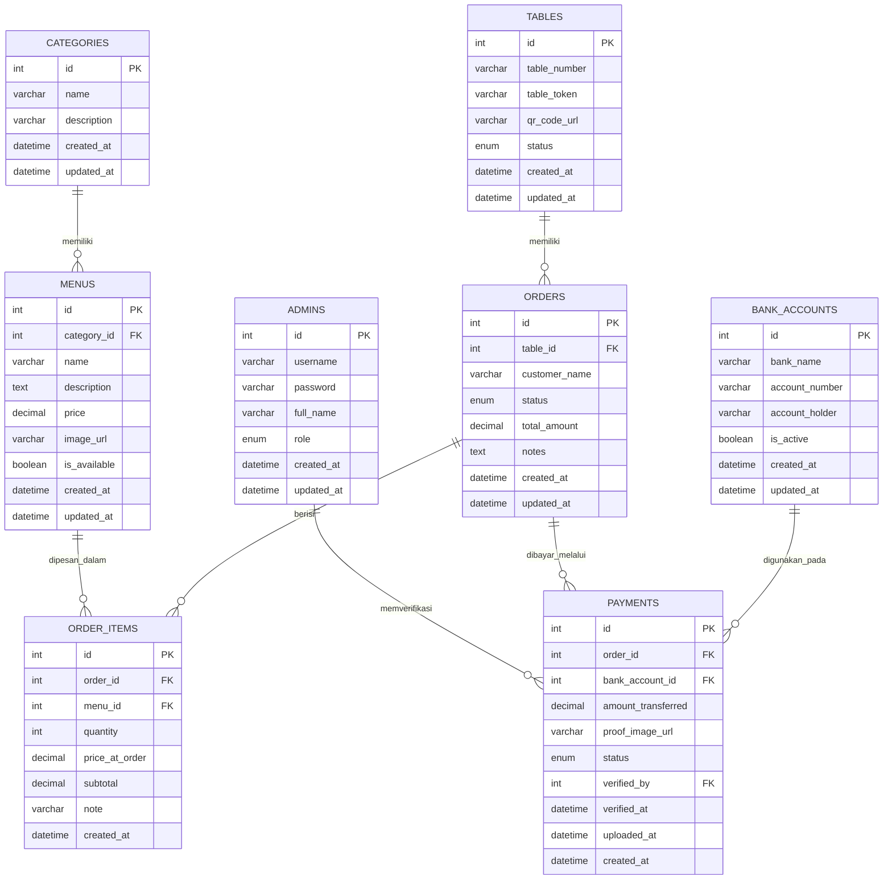

# ERD (Entity Relationship Diagram)
## Sistem Pemesanan Menu Makanan Berbasis Barcode Meja

---

## 1. Daftar Entitas (Tabel)

| No | Entitas | Deskripsi |
|---|---|---|
| 1 | `admins` | Data akun admin/kasir yang login ke dashboard |
| 2 | `tables` | Data meja beserta token unik untuk barcode/QR |
| 3 | `categories` | Kategori menu (makanan, minuman, snack, dll) |
| 4 | `menus` | Data menu yang dijual |
| 5 | `orders` | Data pesanan yang dibuat pelanggan per meja |
| 6 | `order_items` | Detail item dalam satu pesanan |
| 7 | `payments` | Data pembayaran & bukti transfer per pesanan |
| 8 | `bank_accounts` | Data rekening tujuan pembayaran |

---

## 2. Detail Struktur Tabel

### 2.1 `admins`
| Field | Tipe Data | Keterangan |
|---|---|---|
| id | INT, PK, AUTO_INCREMENT | |
| username | VARCHAR(50), UNIQUE | |
| password | VARCHAR(255) | disimpan dalam bentuk hash |
| full_name | VARCHAR(100) | |
| role | ENUM('admin','kasir') | default: 'admin' |
| created_at | DATETIME | |
| updated_at | DATETIME | |

### 2.2 `tables`
| Field | Tipe Data | Keterangan |
|---|---|---|
| id | INT, PK, AUTO_INCREMENT | |
| table_number | VARCHAR(10), UNIQUE | contoh: "1", "VIP-2" |
| table_token | VARCHAR(100), UNIQUE | token acak untuk keamanan URL barcode |
| qr_code_url | VARCHAR(255) | path/file gambar QR yang digenerate |
| status | ENUM('active','inactive') | default: 'active' |
| created_at | DATETIME | |
| updated_at | DATETIME | |

### 2.3 `categories`
| Field | Tipe Data | Keterangan |
|---|---|---|
| id | INT, PK, AUTO_INCREMENT | |
| name | VARCHAR(50) | contoh: "Makanan", "Minuman" |
| description | VARCHAR(255) | nullable |
| created_at | DATETIME | |
| updated_at | DATETIME | |

### 2.4 `menus`
| Field | Tipe Data | Keterangan |
|---|---|---|
| id | INT, PK, AUTO_INCREMENT | |
| category_id | INT, FK → categories.id | |
| name | VARCHAR(100) | |
| description | TEXT | nullable |
| price | DECIMAL(10,2) | |
| image_url | VARCHAR(255) | nullable |
| is_available | BOOLEAN | default: true |
| created_at | DATETIME | |
| updated_at | DATETIME | |

### 2.5 `orders`
| Field | Tipe Data | Keterangan |
|---|---|---|
| id | INT, PK, AUTO_INCREMENT | |
| table_id | INT, FK → tables.id | |
| customer_name | VARCHAR(100) | nullable, opsional diisi pelanggan |
| status | ENUM('pending_payment','waiting_verification','confirmed','rejected','processing','completed','cancelled') | default: 'pending_payment' |
| total_amount | DECIMAL(10,2) | total harga pesanan |
| notes | TEXT | catatan umum pesanan, nullable |
| created_at | DATETIME | |
| updated_at | DATETIME | |

### 2.6 `order_items`
| Field | Tipe Data | Keterangan |
|---|---|---|
| id | INT, PK, AUTO_INCREMENT | |
| order_id | INT, FK → orders.id | |
| menu_id | INT, FK → menus.id | |
| quantity | INT | |
| price_at_order | DECIMAL(10,2) | harga menu saat dipesan (snapshot harga) |
| subtotal | DECIMAL(10,2) | quantity × price_at_order |
| note | VARCHAR(255) | catatan per item, nullable, contoh: "tidak pedas" |
| created_at | DATETIME | |

### 2.7 `payments`
| Field | Tipe Data | Keterangan |
|---|---|---|
| id | INT, PK, AUTO_INCREMENT | |
| order_id | INT, FK → orders.id | |
| bank_account_id | INT, FK → bank_accounts.id | rekening tujuan yang digunakan saat itu |
| amount_transferred | DECIMAL(10,2) | nominal yang harus/sudah ditransfer |
| proof_image_url | VARCHAR(255) | path file bukti transfer |
| status | ENUM('pending','verified','rejected') | default: 'pending' |
| verified_by | INT, FK → admins.id | nullable, admin yang memverifikasi |
| verified_at | DATETIME | nullable |
| uploaded_at | DATETIME | |
| created_at | DATETIME | |

### 2.8 `bank_accounts`
| Field | Tipe Data | Keterangan |
|---|---|---|
| id | INT, PK, AUTO_INCREMENT | |
| bank_name | VARCHAR(50) | contoh: "BCA", "Mandiri" |
| account_number | VARCHAR(50) | |
| account_holder | VARCHAR(100) | atas nama |
| is_active | BOOLEAN | default: true, hanya 1 rekening aktif ditampilkan ke customer |
| created_at | DATETIME | |
| updated_at | DATETIME | |

---

## 3. Relasi Antar Tabel

| Dari | Ke | Jenis Relasi | Keterangan |
|---|---|---|---|
| `tables` | `orders` | One-to-Many | Satu meja bisa punya banyak pesanan (riwayat) |
| `categories` | `menus` | One-to-Many | Satu kategori punya banyak menu |
| `orders` | `order_items` | One-to-Many | Satu pesanan terdiri dari banyak item |
| `menus` | `order_items` | One-to-Many | Satu menu bisa muncul di banyak order_items |
| `orders` | `payments` | One-to-Many | Satu pesanan bisa punya lebih dari satu bukti pembayaran (misal upload ulang jika ditolak) |
| `bank_accounts` | `payments` | One-to-Many | Satu rekening bisa dipakai di banyak transaksi |
| `admins` | `payments` | One-to-Many | Satu admin bisa memverifikasi banyak pembayaran |

---

## 4. Diagram ERD (Mermaid)

---

## 5. Catatan Desain

- **`table_token`** pada tabel `tables` digunakan sebagai parameter unik di URL barcode (`?table=1&token=xxxxx`) agar link pemesanan tidak mudah ditebak/disalahgunakan orang lain.
- **`price_at_order`** di `order_items` sengaja disimpan sebagai snapshot harga saat itu, agar jika harga menu berubah di kemudian hari, riwayat pesanan lama tetap akurat.
- **`payments`** dibuat relasi one-to-many terhadap `orders` untuk mengakomodasi kasus pelanggan upload ulang bukti pembayaran jika bukti pertama ditolak admin. Payment yang dianggap valid/final adalah yang berstatus `verified` dengan `verified_at` terbaru.
- **`bank_accounts`** dipisah dari `payments` agar admin bisa mengelola beberapa rekening, namun hanya satu yang `is_active = true` yang ditampilkan ke pelanggan saat checkout.
- Semua tabel transaksional (`orders`, `order_items`, `payments`) menyimpan `created_at` untuk keperluan audit & laporan.
- Disarankan menambahkan **index** pada `orders.table_id`, `orders.status`, dan `payments.status` karena kolom ini akan sering difilter di dashboard admin.

---

*ERD ini merupakan turunan langsung dari PRD sebelumnya dan menjadi dasar untuk pembuatan skema SQL (`CREATE TABLE`) pada tahap implementasi database di MySQL/Laragon.*
